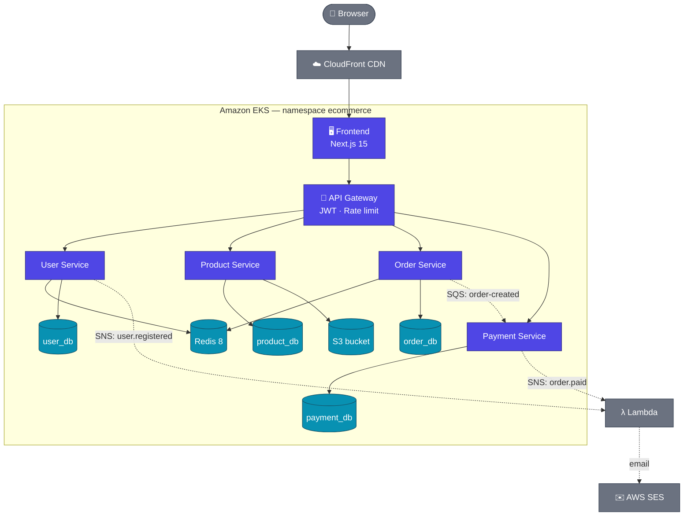
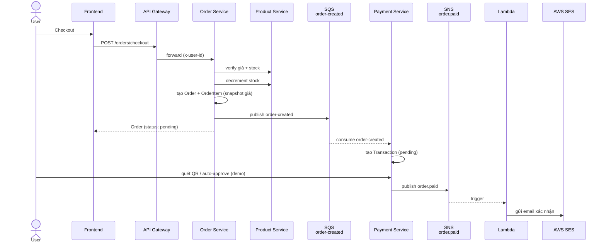
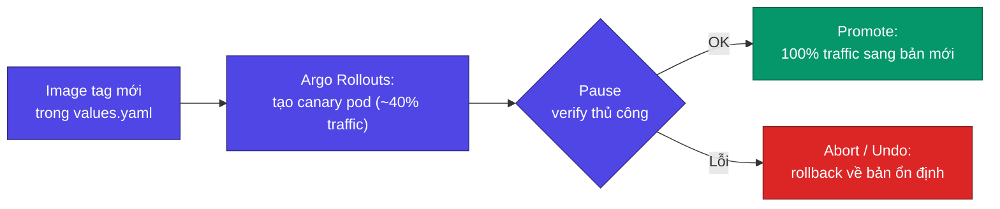

# E-commerce Microservices Platform

Đồ án DevSecOps — Nền tảng thương mại điện tử theo kiến trúc microservices, triển khai trên AWS với pipeline **Jenkins CI → ArgoCD CD → EKS**.

---

## Mục lục

1. [Tổng quan kiến trúc](#tổng-quan-kiến-trúc)
2. [Tech Stack](#tech-stack)
3. [Cấu trúc thư mục](#cấu-trúc-thư-mục)
4. [Luồng CI/CD](#luồng-cicd)
5. [Môi trường](#môi-trường)
6. [Design Patterns](#design-patterns)
7. [Quyết định Cost](#quyết-định-cost)
8. [Roadmap](#roadmap)
9. [Lưu ý quan trọng](#lưu-ý-quan-trọng)

---

## Tổng quan kiến trúc

### Kiến trúc tổng thể



### Services

| Service | Port | Chức năng |
|---------|------|-----------|
| api-gateway | 3000 | Entry point duy nhất — JWT validation, rate limiting, reverse proxy |
| user-service | 3001 | Đăng ký, đăng nhập, refresh token, profile, địa chỉ giao hàng |
| product-service | 3002 | Catalog sản phẩm, full-text search tiếng Việt, upload ảnh S3 |
| order-service | 3003 | Giỏ hàng (Redis), checkout, quản lý đơn hàng |
| payment-service | 3004 | VNPay/MoMo demo, QR code, SQS consumer, webhook |
| frontend | 3005 | Next.js 15 storefront (SSR + CSR) |

### Luồng đặt hàng (checkout → thanh toán)

Luồng bất đồng bộ quan trọng nhất của hệ thống — Order Service và Payment Service hoàn toàn decoupled qua SQS/SNS:



---

## Tech Stack

### Backend — mỗi service
| Công nghệ | Version | Mục đích |
|-----------|---------|---------|
| Node.js | 22 LTS | Runtime |
| NestJS | 11.x | Framework |
| TypeScript | 5.8.x | Ngôn ngữ |
| TypeORM | 0.3.x | ORM + migrations |
| PostgreSQL | 17 | Database chính |
| Redis | 8 | Cart cache & token blacklist |
| AWS SDK v3 | 3.750+ | S3, SQS, SNS, SES |
| bcryptjs | 2.x | Bcrypt hash password |
| passport-jwt | 4.x | JWT guard |
| class-validator | 0.14.x | DTO validation |

### Frontend
| Công nghệ | Version | Mục đích |
|-----------|---------|---------|
| Next.js | 15.x | React framework (App Router) |
| React | 19.x | UI library |
| TypeScript | 5.8.x | Ngôn ngữ |
| TailwindCSS | 3.4.x | Styling |

### Infrastructure & DevSecOps
| Công nghệ | Mục đích |
|-----------|---------|
| AWS EKS | Kubernetes cluster (t3.medium On-Demand × 3) |
| AWS RDS PostgreSQL 17 | Managed database |
| AWS S3 + CloudFront | Product image storage + CDN |
| AWS SQS + SNS | Async messaging |
| AWS SES | Email service |
| AWS ECR | Docker image registry |
| AWS Secrets Manager | Secret management |
| AWS CloudWatch Container Insights | Metrics CPU/memory/network + logs tất cả pods |
| AWS X-Ray | Distributed tracing — visualize request qua microservices |
| AWS ADOT (OpenTelemetry) | Collector nhận traces từ services, forward lên X-Ray |
| OpenTelemetry SDK | Instrumentation trong mỗi NestJS service (`tracing.ts`) |
| Terraform | Infrastructure as Code |
| Helm | Kubernetes package manager |
| ArgoCD | GitOps continuous delivery |
| Argo Rollouts | Canary deployment cho frontend |
| Jenkins | CI pipeline (SonarQube Quality Gate + Trivy) |
| SonarQube | Static code analysis (SAST) — Quality Gate enforce trên mọi PR |
| Trivy | Container image security scan |
| Docker Compose + LocalStack | Local development |

---

## Cấu trúc thư mục

```
DevSecOps-Project/
│
├── services/                          # Backend microservices (NestJS)
│   ├── api-gateway/                   # Port 3000 — entry point
│   │   ├── src/
│   │   │   ├── common/                # JWT middleware trước proxy
│   │   │   ├── config/
│   │   │   └── main.ts                # CORS, rate limit, proxy setup
│   │   ├── Dockerfile
│   │   └── Jenkinsfile
│   │
│   ├── user-service/                  # Port 3001
│   │   ├── src/
│   │   │   ├── auth/                  # Register, login, refresh, logout
│   │   │   ├── users/                 # Profile, addresses
│   │   │   ├── common/                # Guards, decorators, filters
│   │   │   └── database/migrations/
│   │   ├── Dockerfile
│   │   └── Jenkinsfile
│   │
│   ├── product-service/               # Port 3002
│   │   ├── src/
│   │   │   ├── products/              # CRUD, upload ảnh
│   │   │   ├── categories/            # Category tree (self-referential)
│   │   │   ├── search/                # Full-text search tiếng Việt
│   │   │   ├── upload/                # S3 PutObject, CloudFront URL
│   │   │   └── database/migrations/
│   │   ├── Dockerfile
│   │   └── Jenkinsfile
│   │
│   ├── order-service/                 # Port 3003
│   │   ├── src/
│   │   │   ├── cart/                  # Redis cart operations
│   │   │   ├── orders/                # Checkout flow, order management
│   │   │   └── database/migrations/
│   │   ├── Dockerfile
│   │   └── Jenkinsfile
│   │
│   └── payment-service/               # Port 3004
│       ├── src/
│       │   ├── payments/              # VNPay demo, QR, auto-approve
│       │   ├── common/sqs-consumer/   # Poll SQS queue order-created
│       │   └── database/migrations/
│       ├── Dockerfile
│       └── Jenkinsfile
│
├── frontend/                          # Next.js 15 — Port 3005
│   ├── src/
│   │   ├── app/                       # App Router (products, cart, checkout, orders, profile...)
│   │   ├── components/
│   │   ├── contexts/                  # AuthContext, CartContext
│   │   └── lib/                       # API client, types, utils
│   ├── Dockerfile
│   └── Jenkinsfile
│
├── infra/
│   ├── docker/                        # Script init LocalStack + multi-database
│   ├── scripts/                       # Seed dữ liệu sản phẩm
│   │
│   ├── terraform/                     # AWS Infrastructure as Code
│   │   ├── vpc.tf, eks.tf, rds.tf
│   │   ├── s3.tf, cloudfront.tf
│   │   ├── sqs.tf, sns.tf, iam.tf, secrets.tf
│   │   └── variables.tf, outputs.tf
│   │
│   └── k8s/                           # Helm charts (GitOps — ArgoCD đọc)
│       ├── api-gateway/, user-service/, product-service/
│       ├── order-service/, payment-service/, frontend/, redis/
│       │   └── values.yaml + values.dev.yaml + templates/
│       └── observability/             # ADOT Collector (OTel → X-Ray)
│
├── docker-compose.yml                 # Local dev: tất cả services + LocalStack
├── CLAUDE.md                          # Context cho AI assistant
└── README.md                          # File này
```

---

## Luồng CI/CD

```mermaid
flowchart LR
    DEV["👨‍💻 Developer"] -->|git push| GH1["GitHub<br/>main / develop"]
    GH1 -->|webhook| CI

    subgraph CI["Jenkins CI Pipeline"]
        direction TB
        C1["Detect changes<br/>(theo từng service)"] --> C2["Lint & Build"]
        C2 --> C3["Unit + Integration Tests<br/>(PostgreSQL + Redis)"]
        C3 --> C4["SonarQube SAST<br/>Quality Gate"]
        C4 --> C5["Trivy<br/>container scan"]
        C5 --> C6["Build & push<br/>AWS ECR"]
        C6 --> C7["Update values.yaml<br/>+ git push"]
    end

    C7 --> GH2["GitHub<br/>infra/k8s"]
    GH2 -->|poll ~3 phút| ARGO["ArgoCD"]
    ARGO -->|sync| EKS["EKS<br/>ecommerce / ecommerce-dev"]

    classDef stage fill:#4f46e5,stroke:#312e81,color:#fff
    class C1,C2,C3,C4,C5,C6,C7 stage
```



**Ghi chú:**
- `[skip ci]` trong commit message ngăn manifest commit (bước cuối) trigger lại pipeline.
- Phát hiện thay đổi dùng `currentBuild.changeSets` (Jenkins SCM API) — chính xác với cả single commit, batch push và merge commit.
- Mỗi service có Jenkins job riêng, chỉ build khi có thay đổi trong thư mục service tương ứng — tránh rebuild toàn bộ monorepo.
- ArgoCD là nguồn sự thật duy nhất (source of truth) cho trạng thái cluster — Jenkins **không** chạy `kubectl apply`.

### Canary Deployment (frontend)



ALB sticky sessions (`stickiness.lb_cookie`) đảm bảo mỗi user luôn hit cùng một pod version trong lúc canary đang chạy — tránh CSS hash mismatch giữa bản mới và bản cũ.

---

## Môi trường

| | Production | Dev |
|--|------------|-----|
| **Namespace** | `ecommerce` | `ecommerce-dev` |
| **Nhánh Git** | `main` | `develop` |
| **Trigger** | Jenkins pipeline (per-service) | Jenkins Multibranch Pipeline (webhook) |
| **Cluster** | `ecommerce-eks` (ap-southeast-1) | cùng cluster |

> Chi tiết hạ tầng, vận hành, shutdown/startup, secrets... xem [CLAUDE.md](CLAUDE.md)

---

## Design Patterns

### Distributed JWT
Mỗi service tự verify JWT bằng shared `JWT_ACCESS_SECRET` — không gọi User Service. Giảm latency và tránh single point of failure. API Gateway validate và forward `x-user-id`, `x-user-email`, `x-user-role` qua internal headers.

### Snapshot Pattern (OrderItem)
Giá và tên sản phẩm được snapshot vào `order_items` tại thời điểm checkout. Lịch sử đơn hàng không bị ảnh hưởng khi sản phẩm thay đổi giá sau đó.

### Async Messaging (SQS Decoupling)
Order Service publish event `order-created` lên SQS sau khi tạo đơn thành công. Payment Service có SQS Consumer tự động poll queue và tạo Transaction. Hai service hoàn toàn decoupled — Order không cần biết Payment đang làm gì.

### Cart trên Redis
Giỏ hàng lưu Redis với key `cart:{userId}`, TTL 7 ngày. Tự expire, không tốn storage PostgreSQL, read/write O(1).

### Full-text Search tiếng Việt
PostgreSQL extension `unaccent` + `pg_trgm` + `to_tsvector` với config `vietnamese_unaccent`. DB trigger tự cập nhật `tsvector` khi product thay đổi. GIN index đảm bảo query sub-millisecond. Thay thế OpenSearch để tiết kiệm chi phí.

### GitOps (Jenkins → ArgoCD)
Jenkins CI chỉ build image và cập nhật `image.tag` trong `values.yaml` rồi push lên Git. ArgoCD là source of truth — tự detect diff và apply lên EKS.

### Canary Deployment (Argo Rollouts)
Frontend dùng `argoproj.io/v1alpha1 Rollout` thay vì `apps/v1 Deployment` để giảm rủi ro khi deploy bản mới — xem sơ đồ ở mục [Luồng CI/CD](#luồng-cicd).

---

## Quyết định Cost

| AWS Service | Quyết định | Lý do |
|-------------|-----------|-------|
| Aurora PostgreSQL | ❌ → RDS PostgreSQL | Aurora không có free tier |
| ElastiCache Redis | ❌ → Redis pod trong EKS | Tiết kiệm chi phí managed cache |
| OpenSearch | ❌ → PostgreSQL FTS | Đủ cho quy mô catalog hiện tại |
| Cognito | ❌ → JWT tự build | Hiểu sâu hơn, không vendor lock-in |
| EKS | ✅ On-Demand t3.medium × 3 | Đủ chạy 6 services + monitoring stack |
| Lambda | ✅ | Free tier 1M invocations/tháng |
| S3 + CloudFront | ✅ | Gần miễn phí với traffic thấp |
| SQS + SNS | ✅ | Free tier 1M requests/tháng |
| SES | ✅ | 62k email/tháng miễn phí |
| Secrets Manager | ✅ | Bắt buộc cho DevSecOps |

---

## Roadmap

### ✅ Đã hoàn thành

- [x] 6 microservices NestJS + frontend Next.js 15 hoàn chỉnh
- [x] Docker Compose local dev với LocalStack (S3, SQS, SNS, SES)
- [x] Terraform: VPC, EKS, RDS, S3, CloudFront, SQS, SNS, IAM IRSA
- [x] Helm charts cho 7 services (6 app + redis)
- [x] ArgoCD GitOps CD — auto sync khi values.yaml thay đổi
- [x] AWS Load Balancer Controller — ALB Ingress
- [x] Jenkins CI: Lint → Unit Test → Integration Test → SonarQube → Trivy → ECR → GitOps
- [x] IRSA cho product/order/payment/user service
- [x] S3 product images + CloudFront CDN
- [x] SQS async: Order → Payment decoupling
- [x] Full e-commerce flow: browse → cart → checkout → QR payment → confirm
- [x] **Dev/Test environment** — namespace `ecommerce-dev`, Jenkins Multibranch Pipeline, `values.dev.yaml` overlay riêng
- [x] **Reliable change detection** — `currentBuild.changeSets` API thay vì diff thủ công, chính xác cho mọi kiểu push
- [x] **Address management** — quản lý địa chỉ giao hàng, checkout auto-fill
- [x] **Canary Deployment (Argo Rollouts v1.9.0)** — frontend chuyển `Deployment` → `Rollout`
- [x] **CloudWatch Container Insights + AWS X-Ray** — metrics/logs toàn bộ pods, distributed tracing qua các services
- [x] **SonarQube Quality Gate enforcement** — tất cả services pass QG, tích hợp trực tiếp vào scanner

### 📋 Kế hoạch tiếp theo (nếu mở rộng)

- [ ] **HTTPS/TLS** — AWS ACM certificate + ALB HTTPS listener
- [ ] **AWS Secrets Manager + External Secrets Operator** — thay plain-text K8s Secret bằng ESO sync
- [ ] **Elastic IP cho Jenkins EC2** — URL ổn định khi EC2 restart

---

## Lưu ý quan trọng

- **KHÔNG commit `.env`** — dùng `.env.example` làm template, secret quản lý qua AWS Secrets Manager
- **`synchronize: false`** trong tất cả TypeORM config — migrations phải chạy thủ công, KHÔNG để TypeORM tự tạo/alter schema
- **Price lưu BIGINT (VND)** — không dùng DECIMAL/FLOAT để tránh floating point error
- **Sau `docker compose down -v`** — phải chạy lại tất cả migrations
- **Image rebuild** sau khi thay đổi `package.json`: `docker compose build --no-cache <service>`
- **Admin role** — set trực tiếp trong DB: `UPDATE users SET role = 'admin' WHERE email = '...'`
