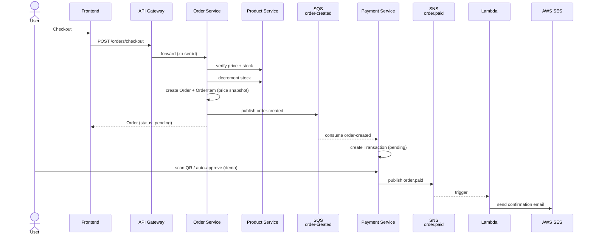
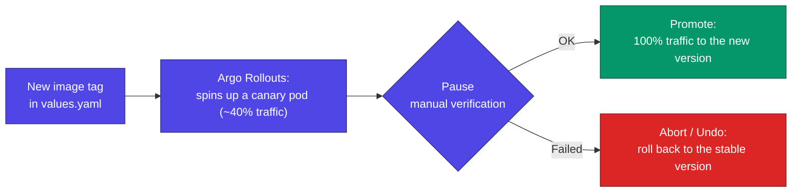

# E-commerce Microservices Platform

A DevSecOps capstone project — an e-commerce platform built with a microservices architecture, deployed on AWS with a **Jenkins CI → ArgoCD CD → EKS** pipeline.

---

## Table of Contents

1. [Architecture Overview](#architecture-overview)
2. [Tech Stack](#tech-stack)
3. [Project Structure](#project-structure)
4. [CI/CD Flow](#cicd-flow)
5. [Environments](#environments)
6. [Design Patterns](#design-patterns)
7. [Cost Decisions](#cost-decisions)
8. [Roadmap](#roadmap)
9. [Important Notes](#important-notes)

---

## Architecture Overview

### Overall Architecture


### Services

| Service | Port | Responsibility |
|---------|------|-----------|
| api-gateway | 3000 | Single entry point — JWT validation, rate limiting, reverse proxy |
| user-service | 3001 | Registration, login, refresh token, profile, shipping addresses |
| product-service | 3002 | Product catalog, Vietnamese full-text search, S3 image upload |
| order-service | 3003 | Cart (Redis), checkout, order management |
| payment-service | 3004 | VNPay/MoMo demo, QR code, SQS consumer, webhook |
| frontend | 3005 | Next.js 15 storefront (SSR + CSR) |

### Order Flow (checkout → payment)

The most important asynchronous flow in the system — Order Service and Payment Service are fully decoupled via SQS/SNS:



---

## Tech Stack

### Backend — each service
| Technology | Version | Purpose |
|-----------|---------|---------|
| Node.js | 22 LTS | Runtime |
| NestJS | 11.x | Framework |
| TypeScript | 5.8.x | Language |
| TypeORM | 0.3.x | ORM + migrations |
| PostgreSQL | 17 | Primary database |
| Redis | 8 | Cart cache & token blacklist |
| AWS SDK v3 | 3.750+ | S3, SQS, SNS, SES |
| bcryptjs | 2.x | Password hashing |
| passport-jwt | 4.x | JWT guard |
| class-validator | 0.14.x | DTO validation |

### Frontend
| Technology | Version | Purpose |
|-----------|---------|---------|
| Next.js | 15.x | React framework (App Router) |
| React | 19.x | UI library |
| TypeScript | 5.8.x | Language |
| TailwindCSS | 3.4.x | Styling |

### Infrastructure & DevSecOps
| Technology | Purpose |
|-----------|---------|
| AWS EKS | Kubernetes cluster (t3.medium On-Demand × 3) |
| AWS RDS PostgreSQL 17 | Managed database |
| AWS S3 + CloudFront | Product image storage + CDN |
| AWS SQS + SNS | Async messaging |
| AWS SES | Email service |
| AWS ECR | Docker image registry |
| AWS Secrets Manager | Secret management |
| AWS CloudWatch Container Insights | CPU/memory/network metrics + logs for all pods |
| AWS X-Ray | Distributed tracing — visualize requests across microservices |
| AWS ADOT (OpenTelemetry) | Collector that receives traces from services and forwards them to X-Ray |
| OpenTelemetry SDK | Instrumentation in each NestJS service (`tracing.ts`) |
| Terraform | Infrastructure as Code |
| Helm | Kubernetes package manager |
| ArgoCD | GitOps continuous delivery |
| Argo Rollouts | Canary deployment for the frontend |
| Jenkins | CI pipeline (SonarQube Quality Gate + Trivy) |
| SonarQube | Static code analysis (SAST) — Quality Gate enforced on every build |
| Trivy | Container image security scan |
| Docker Compose + LocalStack | Local development |

---

## Project Structure

```
DevSecOps-Project/
│
├── services/                          # Backend microservices (NestJS)
│   ├── api-gateway/                   # Port 3000 — entry point
│   │   ├── src/
│   │   │   ├── common/                # JWT middleware, runs before the proxy
│   │   │   ├── config/
│   │   │   └── main.ts                # CORS, rate limit, proxy setup
│   │   ├── Dockerfile
│   │   └── Jenkinsfile
│   │
│   ├── user-service/                  # Port 3001
│   │   ├── src/
│   │   │   ├── auth/                  # Register, login, refresh, logout
│   │   │   ├── users/                 # Profile, addresses
│   │   │   ├── common/                # Guards, decorators, filters
│   │   │   └── database/migrations/
│   │   ├── Dockerfile
│   │   └── Jenkinsfile
│   │
│   ├── product-service/               # Port 3002
│   │   ├── src/
│   │   │   ├── products/              # CRUD, image upload
│   │   │   ├── categories/            # Category tree (self-referential)
│   │   │   ├── search/                # Vietnamese full-text search
│   │   │   ├── upload/                # S3 PutObject, CloudFront URL
│   │   │   └── database/migrations/
│   │   ├── Dockerfile
│   │   └── Jenkinsfile
│   │
│   ├── order-service/                 # Port 3003
│   │   ├── src/
│   │   │   ├── cart/                  # Redis cart operations
│   │   │   ├── orders/                # Checkout flow, order management
│   │   │   └── database/migrations/
│   │   ├── Dockerfile
│   │   └── Jenkinsfile
│   │
│   └── payment-service/               # Port 3004
│       ├── src/
│       │   ├── payments/              # VNPay demo, QR, auto-approve
│       │   ├── common/sqs-consumer/   # Polls the order-created SQS queue
│       │   └── database/migrations/
│       ├── Dockerfile
│       └── Jenkinsfile
│
├── frontend/                          # Next.js 15 — Port 3005
│   ├── src/
│   │   ├── app/                       # App Router (products, cart, checkout, orders, profile...)
│   │   ├── components/
│   │   ├── contexts/                  # AuthContext, CartContext
│   │   └── lib/                       # API client, types, utils
│   ├── Dockerfile
│   └── Jenkinsfile
│
├── infra/
│   ├── docker/                        # LocalStack init + multi-database scripts
│   ├── scripts/                       # Product data seeding
│   │
│   ├── terraform/                     # AWS Infrastructure as Code
│   │   ├── vpc.tf, eks.tf, rds.tf
│   │   ├── s3.tf, cloudfront.tf
│   │   ├── sqs.tf, sns.tf, iam.tf, secrets.tf
│   │   └── variables.tf, outputs.tf
│   │
│   └── k8s/                           # Helm charts (GitOps — read by ArgoCD)
│       ├── api-gateway/, user-service/, product-service/
│       ├── order-service/, payment-service/, frontend/, redis/
│       │   └── values.yaml + values.dev.yaml + templates/
│       └── observability/             # ADOT Collector (OTel → X-Ray)
│
├── docker-compose.yml                 # Local dev: all services + LocalStack
├── CLAUDE.md                          # Context for the AI assistant
└── README.md                          # This file
```

---

## CI/CD Flow

```mermaid
flowchart LR
    DEV["👨‍💻 Developer"] -->|git push| GH1["GitHub<br/>main / develop"]
    GH1 -->|webhook| CI

    subgraph CI["Jenkins CI Pipeline"]
        direction TB
        C1["Detect changes<br/>(per service)"] --> C2["Lint & Build"]
        C2 --> C3["Unit + Integration Tests<br/>(PostgreSQL + Redis)"]
        C3 --> C4["SonarQube SAST<br/>Quality Gate"]
        C4 --> C5["Trivy<br/>container scan"]
        C5 --> C6["Build & push<br/>AWS ECR"]
        C6 --> C7["Update values.yaml<br/>+ git push"]
    end

    C7 --> GH2["GitHub<br/>infra/k8s"]
    GH2 -->|poll ~3 min| ARGO["ArgoCD"]
    ARGO -->|sync| EKS["EKS<br/>ecommerce / ecommerce-dev"]

    classDef stage fill:#4f46e5,stroke:#312e81,color:#fff
    class C1,C2,C3,C4,C5,C6,C7 stage
```



**Notes:**
- `[skip ci]` in the commit message prevents the manifest commit (the final step) from re-triggering the pipeline.
- Change detection uses `currentBuild.changeSets` (Jenkins SCM API) — accurate for single commits, batch pushes, and merge commits alike.
- Each service has its own Jenkins job and only builds when files change in its own directory — avoids rebuilding the whole monorepo.
- ArgoCD is the single source of truth for cluster state — Jenkins **never** runs `kubectl apply`.

### Canary Deployment (frontend)



ALB sticky sessions (`stickiness.lb_cookie`) ensure each user always hits the same pod version while a canary is in progress — avoiding CSS hash mismatches between the new and old versions.

---

## Environments

| | Production | Dev |
|--|------------|-----|
| **Namespace** | `ecommerce` | `ecommerce-dev` |
| **Git branch** | `main` | `develop` |
| **Trigger** | Jenkins pipeline (per-service) | Jenkins Multibranch Pipeline (webhook) |
| **Cluster** | `ecommerce-eks` (ap-southeast-1) | same cluster |

> For infrastructure details, operations, shutdown/startup, secrets, etc. see [CLAUDE.md](CLAUDE.md)

---

## Design Patterns

### Distributed JWT
Each service verifies the JWT itself using a shared `JWT_ACCESS_SECRET` — no call to User Service is needed. This reduces latency and avoids a single point of failure. The API Gateway validates the token and forwards `x-user-id`, `x-user-email`, `x-user-role` via internal headers.

### Snapshot Pattern (OrderItem)
Product price and name are snapshotted into `order_items` at checkout time. Order history remains unaffected by later price changes to the product.

### Async Messaging (SQS Decoupling)
Order Service publishes an `order-created` event to SQS after successfully creating an order. Payment Service has an SQS Consumer that automatically polls the queue and creates a Transaction. The two services are fully decoupled — Order doesn't need to know what Payment is doing.

### Cart on Redis
The cart is stored in Redis under the key `cart:{userId}`, with a 7-day TTL. It expires automatically, doesn't consume PostgreSQL storage, and offers O(1) read/write.

### Vietnamese Full-text Search
Uses the PostgreSQL `unaccent` + `pg_trgm` + `to_tsvector` extensions with the `vietnamese_unaccent` config. A DB trigger automatically updates the `tsvector` whenever a product changes. A GIN index keeps queries sub-millisecond. Replaces OpenSearch to save on cost.

### GitOps (Jenkins → ArgoCD)
Jenkins CI only builds the image and updates `image.tag` in `values.yaml`, then pushes to Git. ArgoCD is the source of truth — it detects the diff and applies it to EKS automatically.

### Canary Deployment (Argo Rollouts)
The frontend uses `argoproj.io/v1alpha1 Rollout` instead of `apps/v1 Deployment` to reduce risk when deploying a new version — see the diagram in [CI/CD Flow](#cicd-flow).

---

## Cost Decisions

| AWS Service | Decision | Reason |
|-------------|-----------|-------|
| Aurora PostgreSQL | ❌ → RDS PostgreSQL | Aurora has no free tier |
| ElastiCache Redis | ❌ → Redis pod in EKS | Saves on managed cache cost |
| OpenSearch | ❌ → PostgreSQL FTS | Sufficient for the current catalog size |
| Cognito | ❌ → Self-built JWT | Deeper understanding, no vendor lock-in |
| EKS | ✅ On-Demand t3.medium × 3 | Enough to run 6 services + monitoring stack |
| Lambda | ✅ | Free tier: 1M invocations/month |
| S3 + CloudFront | ✅ | Nearly free at low traffic |
| SQS + SNS | ✅ | Free tier: 1M requests/month |
| SES | ✅ | 62k free emails/month |
| Secrets Manager | ✅ | Required for DevSecOps |

---

## Roadmap

### ✅ Completed

- [x] 6 NestJS microservices + fully-featured Next.js 15 frontend
- [x] Local dev via Docker Compose with LocalStack (S3, SQS, SNS, SES)
- [x] Terraform: VPC, EKS, RDS, S3, CloudFront, SQS, SNS, IAM IRSA
- [x] Helm charts for 7 services (6 apps + redis)
- [x] ArgoCD GitOps CD — auto-sync when values.yaml changes
- [x] AWS Load Balancer Controller — ALB Ingress
- [x] Jenkins CI: Lint → Unit Test → Integration Test → SonarQube → Trivy → ECR → GitOps
- [x] IRSA for product/order/payment/user service
- [x] S3 product images + CloudFront CDN
- [x] SQS async: Order → Payment decoupling
- [x] Full e-commerce flow: browse → cart → checkout → QR payment → confirm
- [x] **Dev/Test environment** — `ecommerce-dev` namespace, Jenkins Multibranch Pipeline, dedicated `values.dev.yaml` overlay
- [x] **Reliable change detection** — `currentBuild.changeSets` API instead of manual diffing, accurate for every push type
- [x] **Address management** — shipping address management, checkout auto-fill
- [x] **Canary Deployment (Argo Rollouts v1.9.0)** — frontend switched from `Deployment` to `Rollout`
- [x] **CloudWatch Container Insights + AWS X-Ray** — metrics/logs for all pods, distributed tracing across services
- [x] **SonarQube Quality Gate enforcement** — all services pass QG, integrated directly into the scanner

### 📋 Next Steps (if extended)

- [ ] **HTTPS/TLS** — AWS ACM certificate + ALB HTTPS listener
- [ ] **AWS Secrets Manager + External Secrets Operator** — replace plain-text K8s Secrets with ESO sync
- [ ] **Elastic IP for the Jenkins EC2 instance** — a stable URL across EC2 restarts

---

## Important Notes

- **NEVER commit `.env`** — use `.env.example` as a template; secrets are managed via AWS Secrets Manager
- **`synchronize: false`** across all TypeORM configs — migrations must be run manually, TypeORM must never auto-create/alter the schema
- **Prices stored as BIGINT (VND)** — no DECIMAL/FLOAT, to avoid floating-point errors
- **After `docker compose down -v`** — all migrations must be re-run
- **Rebuild the image** after changing `package.json`: `docker compose build --no-cache <service>`
- **Admin role** — set directly in the DB: `UPDATE users SET role = 'admin' WHERE email = '...'`
